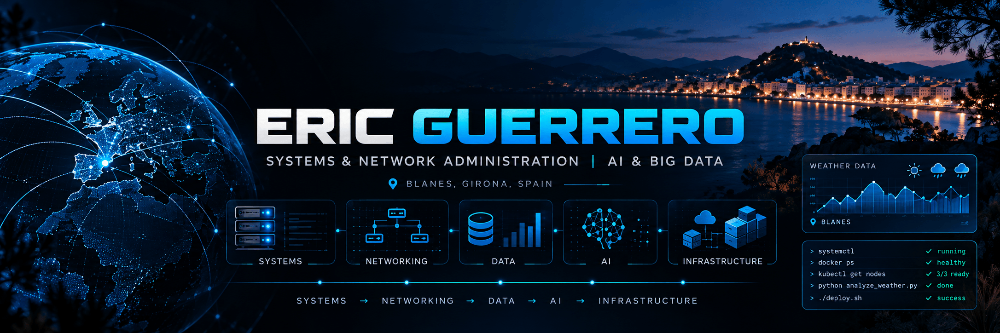

<!-- =========================
     ERIC GUERRERO — PROFILE
========================= -->

<!-- Replace this with your custom banner when ready -->
<!--  -->

# Hi, I'm Eric Guerrero 👋

### Systems & Network Administrator | AI & Big Data Specialization Student

📍 Blanes, Girona, Spain

---

## 👨‍💻 About Me

I'm an IT professional with a background in **Systems and Network Administration**, currently specialising in **Artificial Intelligence and Big Data**.

I'm particularly interested in **data, machine learning and data-driven technologies**, while continuing to build on my experience in systems, networking and IT infrastructure.

---

## 🎯 Current Focus

- 🐍 Python
- 🗄️ SQL & Data Management
- 📊 Data Analysis
- 🤖 Machine Learning
- ⚡ Big Data

---

## 🛠️ Tech Stack

### Systems & Networking

  
  &nbsp;&nbsp;
  

`Windows Server` · `Active Directory` · `TCP/IP` · `DNS` · `DHCP`

### Virtualization & Containers

  
  &nbsp;&nbsp;
  

`Docker` · `VirtualBox`

### Programming & Data

  
  &nbsp;&nbsp;
  

`Python` · `PostgreSQL` · `Power BI`

---

## 🚀 Featured Projects

### 🖥️ PCPitStop — IT Infrastructure

Designed and implemented the IT infrastructure for a simulated small company, covering networking, server administration, security and core business services.

**Tech:** `Windows Server` · `Ubuntu` · `Active Directory` · `DNS` · `DHCP` · `pfSense` · `RAID` · `Apache`

> Repository coming soon.

---

### 🏨 Hotel Management Application

Hotel management system developed with **Python and PostgreSQL**, including database management, bookings, billing, data visualization and security features.

**Tech:** `Python` · `PostgreSQL` · `SQL` · `Power BI` · `XML` · `SSL`

> Repository coming soon.

---

### 🌐 Digital IT Portfolio

Personal portfolio documenting academic and technical work related to systems administration, networking, virtualization and IT infrastructure.

**Areas:** `Systems` · `Networking` · `Virtualization` · `Security`

> Repository coming soon.

---

## 💼 IT Experience

### 🇲🇹 Xara Collection — IT Assistant
**Malta · 2026**

- Supported the company's IT and network administrator across multiple hospitality properties
- Assisted mainly with **POS systems and printers**
- Helped with day-to-day IT and infrastructure tasks
- Gained practical exposure to **Active Directory, hardware, databases and network infrastructure**
- Supported IT operations across different company locations

### 🇪🇸 Zetta Electrónica — Microcomputer Technician
**Blanes, Spain · Oct 2023 – Mar 2024**

- Installed and configured Windows and Linux systems
- Troubleshot hardware issues and performed maintenance and backups
- Configured local networks and physical/virtual machine connectivity
- Worked with domains in Windows and Ubuntu environments
- Used FileZilla for network file transfers
- Deployed and maintained websites using WordPress, PrestaShop and SSL certificates

---

## 🎓 Education

### Artificial Intelligence & Big Data Specialization
**INS Sa Palomera · Blanes, Spain · 2026–2027**

Currently studying:

`Artificial Intelligence` · `Machine Learning` · `AI Programming` · `Big Data Systems` · `Applied Big Data`

### Higher Technician in Networked Computer Systems Administration — ASIR
**INS Sa Palomera · 2024–2026**

### Technician in Microcomputer Systems and Networks — SMR
**INS Sa Palomera · 2022–2024**

---

## 🏅 Certifications & Languages

### Certifications

- Microsoft Office Specialist — **Word 2019 Associate**
- Microsoft Office Specialist — **Excel 2019 Associate**

### Languages

- 🇪🇸 Spanish — Native
- Catalan — Native
- 🇬🇧 English — B1

---

## 📊 GitHub Stats

---

## 📫 Contact

 

